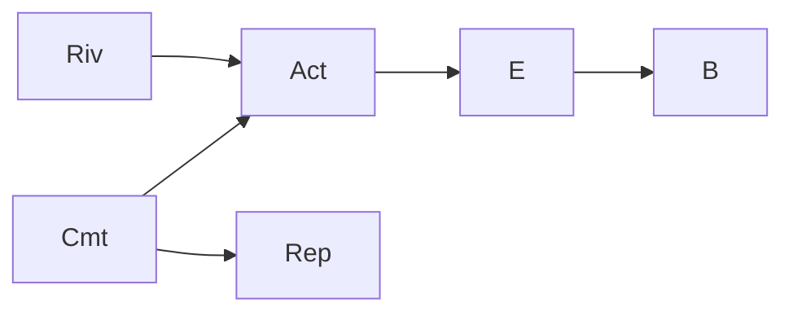
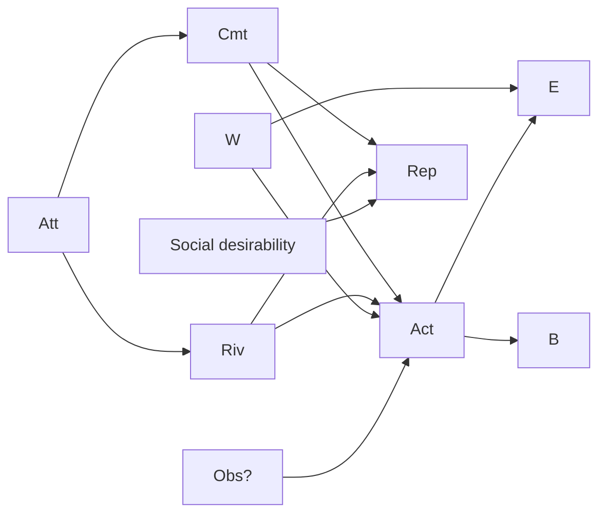
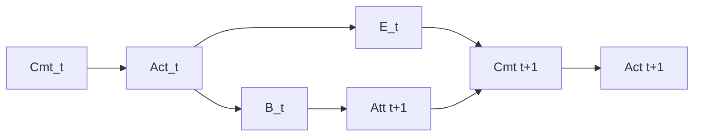

# 02 — Construct ontology

The mandate demands an ontology that survives a measurement theorist, a causal
statistician, and an ethicist simultaneously. The organizing decision, defended in §3:
**the primary scientific object is not "love" but the *commitment-attributed act*** —
love enters as one member of a structured motive family whose members are separated by
evidence patterns, not by introspective labels.

## 1. Classification of the mandated constructs

Legend — **Obs**: directly observable; **Inst**: instrumentally measurable; **Lat**:
latent variable (needs a measurement model); **Norm**: normative judgment (never a
measurement); Causal role: T = candidate treatment, O = outcome, M = moderator,
C = confounder, Med = mediator, B = boundary/bookkeeping term.

| Construct | Epistemic status | Causal role | Notes |
|---|---|---|---|
| Love | Lat (+Norm penumbra) | T (as part of motive complex) | Not one construct: at minimum affect (state), bond (relationship property), and commitment (standing policy). Only the third supports stable causal attribution; see §3. |
| Attachment | Lat | T / C | Psychometrically mature [hazan1987]; the default confounder for any "love" effect. |
| Care | Obs (behavior) / Lat (disposition) | Med / T | Caregiving *acts* are observable; caring *disposition* is latent. |
| Duty | Lat | T (rival) | Distinguished from love by persistence under affect removal — measurable longitudinally. |
| Loyalty | Lat | T (rival) | Behavioral signature: persistence under outside options; revealed-preference accessible. |
| Attraction | Lat (state) | C | Fast-varying; confounds early-relationship energetics. |
| Obsession | Lat (clinical penumbra) | T (rival) | Signature: insensitivity of expenditure to recipient benefit and to recipient feedback; see §5. |
| Compulsion | Lat | T (rival) | Distinguished by ego-dystonic report + cost-insensitivity. |
| Guilt | Lat | T (rival) | Manipulable in vignette studies; leaves a distinct fingerprint (expenditure clustered after transgressions). |
| Fear | Lat | T (rival) / C | Includes fear of partner (coercion marker → routes to ethics variables, not motive weights). |
| Reciprocity | Lat / partially Obs | T (rival) | Ledger-like giving patterns; testable via benefactor-history covariates. |
| Reputation | Lat | T (rival) | Audience manipulation (public/private) identifies it — the one rival motive with a clean experimental knob [bird2005]. |
| Financial incentive | Obs | T (rival) | The *calibration rival*: money is the dose-controllable motive (04 §5 uses it as the measuring rod). |
| Parental obligation | Lat (institutional + felt) | T | Partially observable via legal/custodial status. |
| Covenant / vowed commitment | Obs (the vow) + Lat (adherence) | T | The vow is a public record; adherence is behavior. Scientifically the *best-behaved* love-family construct: datable onset, explicit content. |
| Action intended to benefit another | Lat intention, Obs act | unit of analysis | The base-class event; intention needs prospective records (05 §5). |
| Action that actually benefits another | Inst (domain-specific) | O | Benefit \(B\): measured in recipient-domain units, never joules. |
| Consent / legitimate authorization | Obs/Inst (documented) | gate variable | Not a motive, not an outcome: a *gate* that determines whether an act may be counted or published (ethics-load-bearing). |
| Sacrifice | Derived (Norm-adjacent) | descriptor | Operationalizable only as *foregone-alternative value* + borne risk/burden — never as raw joules (FOUNDATIONS already says this; keep). |
| Waste | Derived/Norm | descriptor | \(E\) in excess of the efficient frontier for the same delivered benefit; requires the frontier to be estimable (usually only bounded). |
| Efficiency | Inst (given boundary) | descriptor | \(B/E\) or exergy efficiency for machine flows. |
| Persistence | Obs | O / signature | Duration under rising cost — the single most diagnostic observable in the whole ontology (§5). |
| Energetic magnitude | Inst | O | \(E_A\), joules. |
| Energetic rate | Inst | O | \(\bar P\), watts. |
| Opportunity cost | Lat (counterfactual) | part of E_C | Exists only relative to a scenario; never directly observable — the fundamental problem lives here. |
| Risk | Inst (actuarial) / Lat (perceived) | separate axis | Recorded in the result vector, not converted to joules. |
| Irreversibility | Obs (act property) | M | Irreversible acts (donation, relocation) carry more evidential weight about commitment than reversible ones — an *evidence* moderator, not a value weight. |

Two constructs the mandate did not list but the ontology requires:

| Construct | Status | Role |
|---|---|---|
| **Motive complex** \(M\) | Lat, vector-valued | The actual treatment. Single-motive attribution is a fiction; the estimand is defined against a *declared partition* of the complex (04 §2). |
| **Commitment** (standing policy to prioritize a person's flourishing) | Lat with Obs anchors (vows, arrangements, defaults) | The recommended primary construct — see §3. |

## 2. Three causal DAGs

Node key: **Cmt** = love-related commitment (focal construct); **Att** = attachment
bond; **Riv** = rival motives (duty, money, status, fear…); **Act** = act selection;
**E** = energy through declared boundary; **B** = recipient benefit; **W** = actor
wealth/technology (delegation capacity); **Rep** = self-reported motive; **Obs?** =
audience presence.

### DAG-1: The naive model the equations implicitly assume

All arrows into Act; energy follows act; benefit follows energy. Under DAG-1, \(a\) =
PN(Cmt→Act) is meaningful and 03's derivation applies. **Empirically defensible arrows:**
Cmt→Act (supported by effort-discounting recipient effects [lockwood2017; jones2006]);
Act→E (definitional given boundary); E→B **not defensible** — benefit flows from the
act's *content*, not its energy (a low-energy act can deliver high benefit); the honest
arrow is Act→B with E as a *side channel*. DAG-1's E→B arrow is the inverse fallacy
drawn as graph structure. Reject that arrow.

### DAG-2: Confounded measurement world (the field study reality)

Attachment drives both commitment and rivals (guilt, fear of loss) → classic
confounding; wealth/technology affects both whether acts happen and how many machine
joules they consume (the delegation counterexample, 09 #9); audience affects act
selection (signaling); self-report is caused by everything including social
desirability, so **Rep is an indicator, never the treatment**. Defensible arrows: all
shown are plausible; the point of DAG-2 is that *no* single-equation adjustment
identifies Cmt→E. Identification requires design: randomize recipient (severs
Att/Riv↔recipient links), randomize audience, randomize incentives (04).

### DAG-3: The feedback world (longitudinal truth)

The arrow **E_t → Cmt_{t+1}** is established psychology: effort justification
[aronson1959], the IKEA effect [norton2012-unv], and the investment model — investment
size *predicts and produces* commitment [rusbult1980]. Energy spent on a person is not
just caused by commitment; it **causes** commitment. Consequences: (i) cross-sectional
attribution is confounded by history; (ii) "his love caused these joules" and "these
joules built his love" are both true at different lags; (iii) any longitudinal estimand
must be defined with explicit time indexing (g-methods territory [hernan-robins]).
This DAG is empirically the best supported of the three and the most damaging to naive
attribution. S5 is designed against it.

## 3. The seven brutal questions

**Q1. Is "love-related commitment" a coherent scientific construct?**
As a *felt essence*, no — it dissolves under the table in §1. As a **standing policy
with observable anchors** (public vows, cohabitation, custody, sustained default
behaviors) plus latent adherence, yes: it meets the standard criteria — datable onset,
inter-rater codable anchors, longitudinal stability, manipulable proxies (recipient
identity in the lab). The program should define its treatment as *commitment to
recipient R*, and treat "love" as the folk superclass. Verdict: coherent **after
narrowing to commitment**; incoherent as an unanalyzed scalar.

**Q2. Can it be distinguished from attachment, duty, or preference strongly enough for
causal attribution?**
In the lab, partially: recipient randomization holds the actor's dispositions constant
and varies the relationship, so *category-level* effects (partner vs. friend vs.
stranger) are identifiable even though motive-level decomposition within a category is
not. In the field, only bounds (04). Between commitment and duty specifically: the
separating evidence is persistence under affect suppression and under released
obligation (duty lapses when the obligation is discharged; commitment does not).
Between commitment and preference: commitment is precisely a policy that *overrides*
momentary preference; the behavioral signature is acting against revealed short-run
preference (getting up at 3 a.m.). These signatures are measurable but expensive.
Verdict: distinguishable at category level, weakly at motive level — which is why the
verdict narrows the estimand to category contrasts.

**Q3. Trait, state, relationship property, action property, or model-dependent label?**
Commitment: a **relationship-indexed disposition** (person×recipient, slowly varying).
Love-as-affect: state. The attribution coefficient \(a\): **model-dependent label**
attached to an *act* — it has no existence outside the declared causal model \(M\), and
the notation should carry that: \(a_{M}\), never bare \(a\) in public outputs.

**Q4. Does the framework commit the inverse fallacy (motive from cost)?**
The documents repeatedly disclaim it (C-012, AGENTS rule 8) — but the *artifact design*
partially commits it: any published per-motive joule total invites reading joules as
motive strength, and DAG-1's E→B arrow smuggles it into the graph. The repair is
structural (00 §F5): attribution flows only motive→energy, never energy→motive;
expenditure enters motive inference only as one likelihood term among many (persistence
patterns, audience independence, benefit sensitivity), never sufficient alone. With
that repair: no.

**Q5. What distinguishes love-directed from obsession-directed persistence?**
Not magnitude — both are large. The separating observables:
1. **Benefit coupling:** love-directed effort tracks recipient-defined benefit and
   *reallocates* when benefit feedback changes; obsession is benefit-insensitive.
2. **Consent response:** love-directed effort attenuates on refusal; obsession
   persists or escalates (also the legal definition of stalking).
3. **Substitutability:** obsession fixates on presence/contact; love accepts
   benefit-equivalent substitutes (paying for care vs. being seen caring).
4. **Actor-welfare coupling:** love maintains a floor under actor self-maintenance
   (imperfectly); compulsion does not.
These are measurable moderator patterns (benefit-sensitivity slope, refusal response),
and 09 uses them on counterexamples #1–2. They belong in the measurement model as
*validity checks* on any high-\(a\) claim.

**Q6. Is recipient benefit necessary for an act to enter the construct?**
No — and it must not be. Requiring benefit would (i) exclude tragic love (failed
rescues), (ii) moralize the treatment definition, and (iii) create selection bias
(conditioning on an outcome). The act enters via *intended* beneficiary; realized
benefit \(B\) stays an outcome. However, **published aggregates must always co-report
\(B\) and consent status** so that benefit-free expenditure is visible for what it is
(guarding Q5's obsession signature).

**Q7. How should the seven cases differ?**
| Case | Treatment definition | Key variable differences |
|---|---|---|
| Parental care | Commitment + institutional obligation; motives inseparable and that is fine — define the complex as "parental commitment" without decomposing | Consent: child assent norms; benefit measured developmentally |
| Emergency rescue | Acute, single-shot; no standing commitment needed — enters as *care act* with identity-of-recipient moderator | Counterfactual is sharp (walk away), so PN is unusually well identified; risk variable dominates |
| Anonymous altruism | No relationship; motive family = agape/principle, not bond | Tests whether the framework's "love" includes non-relational agape — recommended: yes, as separate stratum (the Greek term licenses it) |
| Romantic devotion | Commitment + attraction + attachment entangled; category-level estimand only | Highest confounding; reverse arrow (DAG-3) strongest |
| Friendship | Mid social distance; the dose-response literature's sweet spot [jones2006] | Cleanest for cost-elasticity gradients |
| Religious duty | Covenant with non-human commitment target; recipient = person, principal = God/community | Attribution target must name *whose* flourishing; the framework handles it by splitting commitment-target from benefit-recipient |
| Coerced service | Fear-dominated complex | **Excluded from love-attributed aggregates by the consent/coercion gate regardless of reported motive**; recorded, never celebrated |

## 4. Ontology rulings imported by later files

1. Treatment = *commitment-attributed act*, category-level. (04 estimands)
2. \(a\) is model-indexed and act-level; motives never inferred from cost alone. (03, 05)
3. Benefit, harm, consent are outcome/gate variables in recipient-domain units. (06)
4. The reverse arrow E→Cmt is real; longitudinal designs must use time-indexed
   estimands. (06 S5)
5. Obsession/coercion are handled by signature variables and gates, not by pretending
   the energetics can see the difference. (09)
